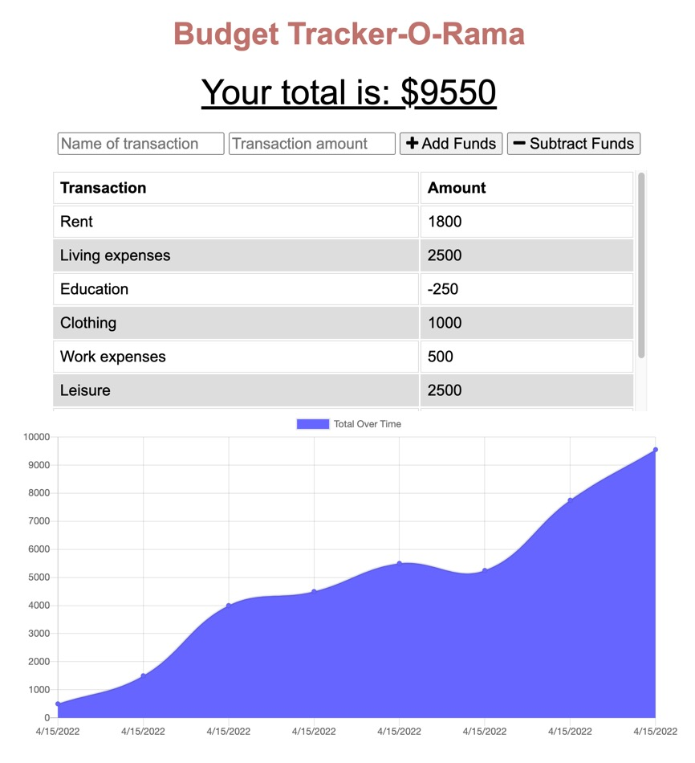

# Tracker Budget-O-rama

## Description

Your challenge this week is to update an existing budget tracker application to allow for offline access and functionality. The user will be able to add expenses and deposits to their budget with or without a connection.

## Table of Contents

- [Submission](#Submission)
- [Screenshot](#Scrrenshot)

## Installation

- Clone repo
- Npm I
- Start MongoDB
- View application in localhost

## Submission

Checkout out the app!

## Screenshot

## Questions

Link to my gitHub: https://github.com/socialcancer

Email @ da@creatorfullstack.com
